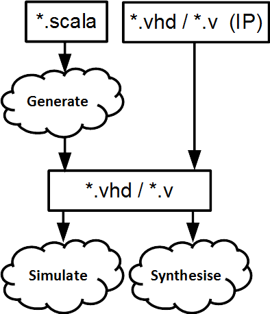

.. _Introduction/SpinalHDL:

SpinalHDLについて
---------------

SpinalHDLとは？
^^^^^^^^^^^^^^^^^^

SpinalHDLについて
SpinalHDLとは?

SpinalHDL は、2014年12月から開発が開始されたオープンソースの高レベルハードウェア記述言語です。
関連ツールも含めて提供されています。

SpinalHDL では、デジタルハードウェアの概念に名前を付けることで、効率的な記述を可能にします。
最も身近な例としては、レジスタ (Reg) やラッチ (Latch) が挙げられます。
VHDL や Verilog などイベント駆動型の言語では、これらの要素を使用するには、プロセスのシミュレーション方法を記述する必要があります。
これにより合成ツールはどのセルを使うべきかを推測できます。SpinalHDL では、単に Reg や Latch を宣言するだけで済みます。

SpinalHDLは、*汎用言語*であるScalaをベースとしたドメイン特化言語 (DSL) です。
この特徴は、以下のようなメリットをもたらします:

* SpinalHDLは、無料の統合開発環境 (IDE) によってサポートされており、シンプルなテキストエディタでは実現できない豊富な機能を利用できます。

  * コード内での構文エラーや型エラーのハイライト表示
  * ファイル間をまたいだリネーム機能
  * インテリジェントな自動補完・推奨機能
  * ナビゲーションツール（定義へのジャンプ、参照箇所の表示など）

* 複数の言語を扱うことなく、シンプルなものから複雑なものまで、さまざまなハードウェアジェネレータを SpinalHDL 単体で実装可能です (meta-hardware
  説明)。

.. note::

   `Scala <https://scala-lang.org/>`_ は、Java 仮想マシン (JVM) を使用する静的型付けの関数型オブジェクト指向言語です。

SpinalHDLとは何ではないか
^^^^^^^^^^^^^^^^^^^^^^^

自動化ハードウェア合成ツール (HLS) ではありません: 
SpinalHDL の目的は、抽象的なアルゴリズムを自動的にデジタル回路に変換することではありません。
デジタル回路設計者がコードを繰り返し書く必要がなく、再利用できるように、適切な命名によって新たな抽象レベルを作り出すことを目指しています。

アナログモデリング言語ではありません: 
VHDLやVerilogは、アナログ設計者がデジタル設計者にIPのモデルを提供することを可能にします。
SpinalHDL はこのような用途ではなく、デジタル設計者がデジタル回路を直接記述するための言語です。

SpinalHDLの開発フロー
^^^^^^^^^^^^^^^^^^^^^^^^^^^

SpinalHDL でコードを記述すると、ツールによって以下のことが可能になります：

* VHDL、Verilog、SystemVerilog の生成。生成されたコードは、これらの言語でインスタンス化したり、シミュレータや合成ツールに渡すことができます。
ロジックのオーバーヘッドはなく、階層構造や名前は保持されます。生成時に設計チェックが行われます。
* Verilator等の対応シミュレータによるシミュレーションの実行
  

SpinalHDL は VHDL や (System)Verilog と相互運用性があるため、以下のようなことが可能です。

* SpinalHDL で生成されたコードを利用し、VHDL や (System)Verilog で SpinalHDL の IP をインスタンス化することができます。
* SpinalHDLの ``BlackBox`` 機能を用いて、VHDL や (System)Verilog で記述された IP を SpinalHDL でインスタンス化することができます。

As SpinalHDL is interoperable with VHDL and (System)Verilog, you can both
instantiate SpinalHDL IPs in these language (using generated code) and
instantiate IPs in these languages in SpinalHDL (using ``BlackBox``).

.. note::

   SpinalHDL は、標準的な VHDL/Verilog ベースの EDA ツール (シミュレータや合成ツール) と完全に相互運用可能です。 
   これは、SpinalHDL のツールチェーンによって生成される出力が、VHDL または Verilog であるためです。

SpinalHDL vs. VHDL/Verilog: ハードウェア記述のレベルアップ
^^^^^^^^^^^^^^^^^^^^^^^^^^^^^^^^^^^^^^^^^^^^^^^^^^^^^^^

従来のハードウェア記述言語 VHDL/Verilog と比較して、SpinalHDL は高レベル言語をベースとすることで、
数々のメリットをもたらし、より快適で生産的なコーディングを実現します。主な利点は以下の通りです:

#. **配線の煩悩から解放** - AXI のような複雑なバスもたった一行で作成・接続可能。
#. **進化する機能** - オリジナルのバス定義や抽象化レイヤーを自在に構築。
#. **劇的なコード削減** - 配線を中心に大幅なコードサイズ削減。コードベースの把握しやすさ、生産性向上、頭痛軽減につながります。
#. **無料で使いやすい IDE** - Scala ツールによる自動補完、エラー強調表示、ナビゲーションショートカットなど多彩な機能が利用可能。
#. **強力かつ簡単な型変換** - 任意のデータ型とビット列との双方向変換がスムーズに実現。複雑なデータ構造を CPU インターフェースから読み込む際に威力を発揮。
#. **設計チェック** - 早期段階でのリンティング (静的解析) により、コンビネーションループやラッチなどの存在を確認。
#. **クロックドメインの安全性** - 意図しないクロックドメイン間のクロッシングを早期段階で警告。
#. **ジェネリックな設計** - Scala の機能を活用し、ハードウェア記述のジェネリック性に制限はありません。

